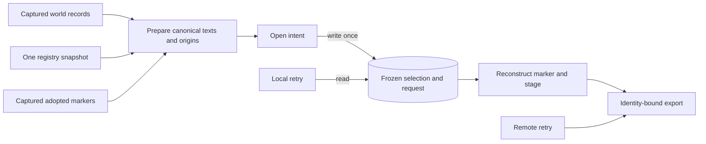

# Publication attribution — origins frozen with the selected records

**Date:** 2026-10-02
**Status:** approved 2026-10-02 by the author after spec round 2 acceptance
**Task:** `beliefs-f50596`
**Boundary:** `publication-attribution`, proposed in `world-read`
**Workspace:** `.worktrees/publication-attribution`, branch `feat/publication-attribution`
**Measured against:** `d466f5f`, the acceptance discharge; this branch is stacked on `feat/acceptance-filter`. Main's independent `abb4f1c` changes only vendored tooling.
**Authority:** Science commons design `2026-09-30-science-commons-design.md` §§4.8 and 7.1; the kernel's `../../designs/2026-09-22-publication-design.md` and its publication-records/local/remote slices
**Cut:** proposed successor to cut 45; the implementation plan rechecks the number before freezing

## 1. Intended outcome

A publication must say which selected records it carries from adopted
publications. If a record travels A → B → C, C retains A's corpus id and marker
uid from B's entry. It does not replace them with B's. The publisher reads these
origins before its intent and freezes them with the selected canonical texts.
Every retry reconstructs the same marker without consulting the original
world, registry or carriers again.

The marker's uid remains `digest(domain, event_token)[:32]`; its address and
`marker_consistent` derivation stay unchanged. Attribution is content and a
publisher's claim. It does not authenticate authorship or require the origin
publication to be held. Science's accept-policy layer owns that decision.

This is commons milestone 1a: each selected world address has one holder.
Overlapping publications remain `beliefs-81367e`. Acceptance is already
discharged at cut 45; the agreed next task after this slice is the bounded
N2 preflight pilot, `beliefs-aa9f88`.

## 2. What the tree already supplies

`publish.py::publish` resolves the view, opens the current epoch, evaluates the
query, checks closure and destination pins, renders canonical records, and
validates a probe `Snapshot` before `_open_publication`. It then writes
`selection.v1` and `request.v1` create-only. `_expected_marker` reconstructs
from the frozen request and snapshot. `resume_publish` has no source-world
argument. After remote reveal, its transport mark and identity-checked export
already suffice without the request or snapshot.

`Snapshot` currently holds `event_token` and `records`, has a closed canonical
encoding, and is bound by `PublishRequest.selection`. The marker's
`published_from` map currently holds exactly `world_id`, `epoch` and `view`.
`require_publication_layout` already checks one marker, its content and
consistency, no binding record, and equality of held ids and marker selection.

The epoch maps world records, while `WorldReadView.captured_records(corpus_id)`
retains the full capture, including a publication's marker. An unchanged
publication may report an unmapped coordination record: `evaluate_query`
refuses only when captured and published corpus states differ. No change to
drift handling or the world address map is required.

`world.registry().admissions` supplies the provenance. `ReplicaOf` refers to
the same admitted corpus id; an existing admission's provenance is immutable.
The registry can therefore be read once before the intent without adding a
provenance facet to the epoch or another field to the read view.

Two existing rules constrain the extension:

- `check_coordination_succession` forbids changing an existing kind's top-level
  fields, including additions. A top-level `attributions` field cannot be added
  by a normal coordination successor.
- `derive_pins` currently unions contributing domains, refuses disagreement,
  and adds the written root's coordination pin. A v3 publisher carrying a v2
  publication needs an explicit rule for the source's coordination pin.

## 3. Decisions

1. **Put entries in `published_from.attributions`.** It is marker content inside
   an existing map, so the outer kind-field inventory remains fixed. Reject a
   new top-level field, a separate attribution record, and an authored lineage
   relation: those respectively break succession, split the frozen content,
   and duplicate scientific ancestry.
2. **Authorize the nested amendment with coordination v3.** Ship it as v2's
   successor, with unchanged outer kind fields and a description naming this
   content rule. Keep `shipped_coordination()` defaulting to v2; v3 is selected
   explicitly by the writer and staging profiles. Reject silently broadening
   v2's closed marker rule.
3. **Extend the existing snapshot with one optional member.** `None` denotes
   the existing format and is omitted from its projection; a tuple, including
   `()`, denotes the new format. Reject another snapshot class, new recovery
   state, side file or format-conversion layer.
4. **For a v3 destination, derive coordination from the writer.** No selected
   record is a coordination record; the destination authors its own marker.
   Preserve the base-contract check and the contributing world-domain union
   and disagreement checks. Read each adopted source marker under its own pin.
   Reject discarding other source domain pins or treating arbitrary domains
   as interchangeable. The v2 destination's existing derivation stays exact.
5. **Use the existing captures and layout check.** Cache a validated source
   marker per selected replica holder during preparation. Reject live carrier
   reads during staging/retry and recursive origin lookup. Forwarding a valid
   entry does not require its named origin to be available.
6. **Amend v2 publishing to refuse adopted holdings.** Name this amendment
   **v2 carried-selection refusal**: new publish attempts under v2 no longer
   publish selected `ReplicaOf` records without attribution. Preserve the
   existing earlier refusals and old in-flight attempts. Reject retaining
   today's unattributed successful path, which would violate Science §4.8.
7. **Enable v3 through new write roots only.** Create a root with a profile
   explicitly activating `shipped_coordination(3)`, then adopt its first
   manifest with that profile's pins through the existing lifecycle API.
   Use the same derived pins for staging. `adopt_manifest` is create-only:
   an existing v2 manifest cannot be re-pinned. Reject a new re-pin act in
   this slice. Existing v2 roots can still publish own-only selections and
   resume old attempts, but cannot newly publish replica-held records. Science
   §11 requires frozen attribution for 1a and does not require pin migration;
   §12's 1a starts B beside a fresh write root. New explicitly v3 roots are
   compatible with that milestone, and are an explicit Science deployment
   prerequisite, not a claim that existing installations upgrade themselves.
8. **Require publication layout from every replica holder.** `admit_arrival`
   can admit markerless restored or moved corpora as `ReplicaOf`; it does not
   establish that a replica is a publication. Such holdings remain readable,
   but v3 publication preparation refuses them as `attribution-source-invalid`
   with `field="marker-absent"`; v2 refuses them under decision 6. This also
   applies to a restored copy of one's own unpublished corpus. Reject treating
   markerless replicas as carrier-owned with no entry: Science §4.8 requires
   every adopted record's marker origin, and the carrier's-own acceptance
   branch needs a publication's `published_from` claim. Do not invent one or
   reclassify registry provenance during publication.

## 4. Marker content and release rules

A v3 marker's coordination facet has the existing top-level fields. Its
`published_from` map has exactly these keys:

```text
world_id, epoch, view, attributions
```

`attributions` is a list of triples:

```text
[[record_address, origin_corpus_id, origin_marker_uid], ...]
```

This matches the existing pair-list convention for `supersedes_markers`.
It is empty for a selection containing no adopted holdings. Each triple has
exactly three exact strings. Its address passes the existing world-record-id
check and belongs to this marker's `selection`; both origin identifiers are
32 lowercase hexadecimal characters. Addresses are strictly ascending and
unique. Validate members before comparing order, so mixed types produce a
malformed result rather than `TypeError`. Unknown keys, duplicate addresses,
unselected addresses and null entries are malformed.

A v2 marker keeps its existing three-key `published_from`, with no attribution
member. A v3 marker requires the member, even when empty. A v2 pin does not
authorize it, and a v3 pin does not silently invent a missing empty list.
Other coordination pins do not authorize this publication content amendment.
Bindings and publication intents gain no field.

Extend the existing factory's keyword arguments:

```python
marker_record(..., attributions: tuple[tuple[str, str, str], ...] | None = None)
```

`None` renders the existing marker. A tuple renders the v3 member. This pure
factory validates content but does not claim to derive origins; the actual
publish act supplies the derived tuple. Existing factory calls retain their
bytes. `marker_uid`, `marker_address` and the `marker_consistent` function body
remain unchanged. Two well-formed markers made from one intent but different
valid origin entries have equal uid/address/id and unequal content.

`publication_content_malformed` recognizes the two closed self-contained
shapes, and `marker_consistent` uses it as today. Keep the signatures of both
and of `require_publication_layout`. Use one private pure marker-release
predicate after content/layout validation at a pinned boundary. It takes the
full `coordination:<content_identity>` pin, accepts exactly the v2/v3 pairing
above, and rejects a missing or unsupported pin. It performs no I/O or trust
lookup; shape-only utilities never stand in for this release check.

Require that predicate at `_stage_marker`, the profile-aware publication check
inside `corpus_check`, `admit_publication`, `publication_tip`, and captured
source preparation. A pinned layout failure retains
`PublicationArrivalRefused("marker-malformed")`; tip reading wraps it in the
existing `PublicationReadingRefused`. The public arrival check happens before
the verified admission writes. Pure factory and intent-position checks do not
claim to authorize a contract release.

In particular, `coordination.py::tips_at` deliberately uses the shape-only
`publication_content_malformed` check while folding revisions at an intent
position. It has no contract-pin authorization role. Preserve that caller and
record it explicitly in the plan's boundary inventory.

The remote export check retains its current identity-first ordering and the
existing content/consistency/count checks. After those checks, it checks marker
release using the validated export's manifest, never the original source world.

## 5. Deriving the entries before the intent

Preserve the existing pre-intent ordering through selection completeness,
closure, derived pins and staging-profile agreement. Then obtain one registry
snapshot, before rendering canonical texts and probe-validating the snapshot.
For each selected canonical address, use `read.corpus_of(address)` to get its
holder and find that holder's admission. Do not infer the holder from an alias,
semantic identity, path or the marker's claimed world id.

This second registry scan runs for **every** new publish, including a v2
own-only selection. Its bytes remain unchanged, but it gains the explicit
preparation requirement that each selected holder have an admission. The
registry scan can raise its existing integrity errors; an absent admission
produces `attribution-holder-unregistered`. Reject skipping this scan for v2:
without provenance it cannot distinguish an own-only selection from replicas.

The registry scan and `open_world_view`'s earlier scan do not share one lock
hold. Admission provenance is immutable, and retirement/departure appends a
status while retaining the admission. A retirement between the two scans
therefore still supplies the same provenance and does **not** cause
`attribution-holder-unregistered`; preparation imposes no new live-status
check. If a selected holder's admission is genuinely missing from the second
scan, fail closed with that named refusal. Malformed registry data retains
its existing earlier scan error. Never guess `Fresh` from a missing admission.

Group the selected addresses by holder, with each group's addresses ascending.
Check that every holder has an admission, in ascending holder order.
For a `Fresh` or `ForkOf` admission, create no carried
entry: this requirement uses exactly the registry's `ReplicaOf` distinction.
For a v3 destination, validate `ReplicaOf` holders in ascending holder order,
once per holder:

1. Read `read.captured_manifest(holder)` and `read.captured_records(holder)`.
   These are the already-held capture, not a reopened root.
2. Call `require_publication_layout`, then the marker-release predicate under
   the captured coordination pin. A generic replica without a publication
   marker cannot supply an origin; a marker with a missing or unauthorized pin
   is `marker-malformed` for this purpose.
3. Keep the single marker uid and its validated attribution map. A v2 source
   has an empty map; a v3 source may have earlier origins.

Finally, emit entries in ascending selected-address order. For each selected
address in a replica holder, use its existing entry if present;
otherwise emit `(address, holder, source_marker.uid)`. Copy an existing triple
unchanged, including its origin corpus and marker identifiers. Never follow
that triple to another carrier. Include only selected replica-held addresses,
not the source marker's unselected entries. The result contains exactly one
entry per selected replica-held record, across every selected world kind.

The snapshot records and origin tuple are both immutable local values before
the intent. Probe-validate their complete snapshot encoding before
`_open_publication`, using the existing probe token. No public `publish`
argument allows a caller to substitute attribution entries.

Once the earlier preconditions and admission checks pass, if the destination
pin is v2 and any selected holder is a replica, refuse
before opening the intent with
`PublicationRefused("attribution-contract-unpinned", corpus_ids=...)`, naming
all selected replica holders in sorted order. There is no un-attributed
fallback. A v2 publication selecting only locally written holdings follows
the existing rendering path after the new admission check and emits its
existing bytes. The earlier pin checks retain precedence: a v2 writer with
a contributing v3 source refuses `pins-disagree`, `field="coordination"`,
before the registry scan and before `attribution-contract-unpinned`.

For a v3 destination, the first invalid source in that holder order is
deterministic. Translate a captured layout or release failure to
`PublicationRefused("attribution-source-invalid", corpus_ids=(holder,),
refs=selected_addresses_in_holder, field=layout_reason)`. Missing admission
information is `PublicationRefused("attribution-holder-unregistered", ...)`,
with the same holder/refs shape. Existing selection, registry and capture
integrity errors keep their current errors and precedence; they are not repaired
or converted into an origin guess.

A legacy v2 source may itself have republished upstream records without any
entries. Its historical marker cannot reveal that earlier origin. The v3
publisher attributes such a record to that v2 carrier's own corpus/marker;
it cannot reconstruct A through a legacy unattributed B. Science's carried
branch therefore has accurate forwarding only from an existing explicit
entry; neither this slice nor the acceptance predicate repairs historical
missing provenance.

## 6. Freezing, staging and recovery

Add `attributions: tuple[tuple[str, str, str], ...] | None = None` to `Snapshot`.
The tuple uses the same member/order/selection checks as the marker. For the
new format its projection includes `attributions` as a list of triples; for
the old format the member is absent. Keep `SELECTION_DOMAIN`, canonical v1
encoding, file name `selection.v1`, and the request's `selection` digest seam.
The decoder accepts exactly those two field sets and requires byte-exact
canonical re-encoding. It does not fill a missing member with an empty tuple.

Changing a valid origin entry changes `Snapshot.identity()` and therefore the
request's selection commitment. Editing only a saved snapshot's origins is
`RequestCorrupt("snapshot-mismatch")`; malformed origins are
`RequestCorrupt("snapshot-undecodable")` through the existing decoder path.
This does not add a claim that coordinated out-of-band rewriting of both
request and snapshot is detectable.

The request must carry a supported destination coordination pin, agreeing with
snapshot format:
v2 requires `None`, v3 requires a tuple. `_load` rejects disagreement as
`RequestCorrupt("snapshot-pin-disagrees")` before staging. Existing incomplete
v2 attempts continue to decode and resume under their original profiles.
No new version field is needed on `PublishRequest` or `TransportMark`.

`_expected_marker` forwards the frozen tuple to `marker_record`. Prefix checking
already compares the marker's canonical bytes, so differing origins make a
staged marker corrupt rather than silently replacing it. The marker is still
written last. The binding still names the marker uid and exported artifact.
After remote reveal, the mark's artifact identity binds the export, including
the marker content; resume reads that validated export without origin lookups.



No retry arrow reaches the preparation inputs. A source corpus disappearing,
a later registry admission, or a source marker changing after preparation
cannot change this attempt's attribution.

## 7. Destination pins

Add v3 to the shipped publication-capable coordination pins. In `derive_pins`:

- Keep the existing base agreement over contributing manifests and the writer.
- For a v2 writer, preserve the current contributing-domain union and every
  disagreement, including coordination disagreement.
- For a v3 writer, union all contributing domains except `coordination`, keeping
  every existing non-coordination disagreement check. Install the writer's v3
  coordination pin for the destination. Its staging profile must equal the
  derived pins, as today.

This is an explicit amendment to Y5's pin derivation for the v3 marker release.
It permits a v3 publisher to carry v2 and v3 publications, whose markers are
read under their own pins. It confers no new interpretation on copied world
records: their base and activated world-domain pins are still the destination's
pins. No source coordination record is in the selected record tuple.

Preserve the v1/v2 contract documents and all frozen cut/declaration bodies.
Keep old v2 Y5 checks and their mutation assertions. The plan owns any required
live sabotage retarget and records its disposition; a stale anchor is never
permission to weaken a check. The plan also rechecks every caller of marker
content/layout validation so no pinned boundary defaults to a shape-only check.

## 8. Guarantees and decisive checks

At freeze, append the next ids after Y16 to the publication table and formal
coverage map. This proposal uses Y17 and Y18; the plan rechecks the live table.
No row is banked or discharged by this spec alone.

| proposed row | guarantee |
|---|---|
| Y17 | Every selected replica-held record receives its source publication or forwarded earlier origin, derived before intent and frozen with selection; retries never re-read origin inputs |
| Y18 | Canonical attribution content is authorized by the marker release, changes the selection commitment and artifact content, and preserves marker identity; source world-domain pins remain required |

Each decisive check must fail under a named mutation in the successor cut.
The plan may split a check into independently named subcases, but must not
drop an obligation or count a collection/syntax failure as killing a check.

| check | decisive result |
|---|---|
| Local holdings | Fresh/ForkOf records receive no carried entry; v2 own-only bytes remain exact; v3 carries an explicit empty list |
| V2 amendment | With two selected v2 replicas and otherwise valid inputs, a v2 writer refuses `attribution-contract-unpinned` with both corpus ids ascending and no intent; a v3 source instead triggers the earlier `pins-disagree` on `coordination`, without a second registry scan |
| V3 activation | A newly created write root adopts explicit v3 pins and publishes; an existing v2 root still refuses a second manifest adoption, and the shipped default remains v2 |
| Markerless replica | A genuinely restored and verified non-publication admitted by `admit_arrival` is `ReplicaOf`; v3 refuses `attribution-source-invalid`/`marker-absent` before intent; v2 refuses the carried selection |
| First carry | A's real v2 publication, adopted by B, supplies A's corpus id and own marker uid for every selected carried record |
| Forwarding | C adopts B's v3 publication and retains A's entry without holding A; a B-authored record falls back to B's own marker |
| Selection scope | Unselected source entries are absent from the output; two selected replica holders get their distinct origins |
| Addresses | Entries use canonical selected ids; malformed, duplicate, out-of-order and unselected addresses refuse |
| Source integrity | Missing/duplicate/malformed marker, binding-present, selection mismatch and missing admission refuse before intent |
| Holder information | A controlled second scan missing a selected holder returns `attribution-holder-unregistered` with that holder and ascending selected refs, including on the v2 own-only path; no intent opens |
| Source precedence | Two invalid replica captures supplied in reverse holder order still report only the ascending first holder and its exact layout reason; admission checks finish before any source layout validation |
| Registry boundary | Retirement after capture retains the admission and origin; a scan integrity error propagates before intent; every new publish scans once during preparation, while retries never scan |
| Legacy source | A historical v2 B carrying A without entries yields B's own origin; an explicit earlier entry in a v3 B is copied unchanged |
| Release guards | v2 with attribution, v3 without attribution, and unsupported publication pins refuse at staged write, corpus check, arrival and tip reading |
| Pin derivation | v3 carries a v2 source; v2 disagreements remain unchanged; differing science or non-coordination domain pins still refuse before intent |
| Identity split | Same intent plus different valid origins preserves marker uid/address/id and consistency; snapshot digest and marker content differ |
| Snapshot integrity | Old bytes round-trip unchanged; new bytes round-trip exactly; an edited origin or mismatched pin/format yields the named corrupt-request result |
| Captured inputs | Origin selection succeeds from the already-held capture after the source carrier becomes inaccessible; no root reopen occurs |
| Local retry | Interrupt population, change/remove origin inputs, then resume to the exact original marker with origin lookup trapped |
| Remote retry | After reveal, retain only mark/export as the existing recovery rule permits; resume with exact origins and no source lookup; export content edits refuse |
| World read | An unchanged adopted publication's unmapped marker does not prevent selection; actual post-epoch state drift still refuses |

Honest end-to-end cases must publish, export, restore and admit real publications
under registered roots on the certified tuple. Raw fixtures are reserved for
labelled malformed metadata and tamper subcases. Keep portable shape checks
distinct from that durable evidence. Start the extended successor run only
after a bounded pilot exercises first carry, forwarding, retry and one mutation
per new row through their verdicts.

## 9. Scope and next gate

Change the publication factory/checks, shipped coordination resource/loader,
pin derivation, existing snapshot codec, and publish preparation/recovery
forwarding. Reuse the world capture and registry APIs; add no world-map member,
new write primitive, runtime dependency, provenance graph, or trust registry.
`root.py` remains the one atoms importer; the existing write-entry inventories
and recent-cut runner inventory remain required checks.

When this slice lands, amend the current-facing publication design and guide
for the v3 nested content rule and Y5's release-specific destination pins.
Preserve frozen cuts and historical release evidence. The implementation plan
owns the successor freeze, row banking, N2 declaration, runner, accounting and
results; none happens before the written spec and plan reviews. Spec round 1
requested these decisions and checks, then planning without another full spec
round; the author accepts this corrected spec under that disposition.

The implementation plan was accepted and author-approved on 2026-10-02; execution begins with the cut-number recheck and freeze. The N2
preflight pilot remains after this publication slice, as agreed; no publication
implementation or pilot has started here.
